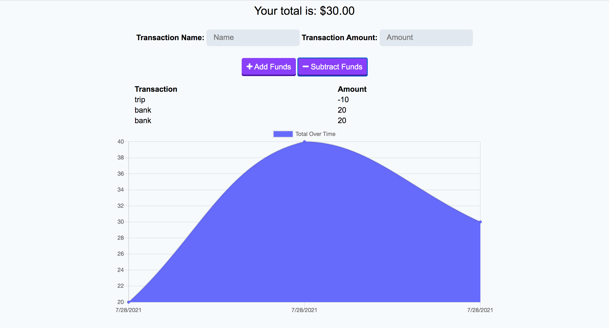

# Online/Offline Budget Trackers 

# Description

Deployed app : https://jo-budgettracker.herokuapp.com/

functionality to our existing Budget Tracker application to allow for offline access and functionality.

# Table of Contents

- [Installation](#installation)
- [Usage](#usage)
- [Contributed](#contributed)
- [License](#license)
- [Questions](#questions)

# Installation

npm i, deployed app

# Usage

The user can add and subtract to keep track of their budget.

# Contributed

Contributers: Jose Orozco

# License

This application is protected under conditions of the MIT license.

# Questions

My Github Profile: http://www.github.com/jose8160  
 If there are any questions contact
jose816orozco@gmail.com
